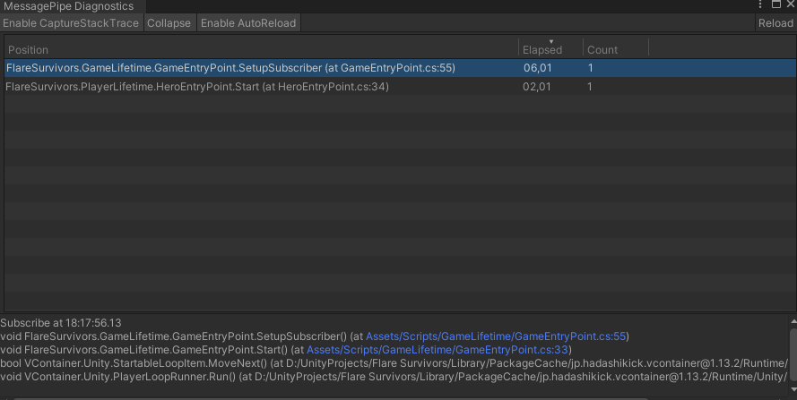

# Unity game architecture Part 2


## More DI, FSM entry points and MessagePipe

<!-- TOC start -->

- [Adding Messages to the Pipe](#adding-messages-to-the-pipe)
- [GameEntryPoint as a Finite State Machine](#gameentrypoint-as-a-finite-state-machine)
- [MessagePipe in action](#messagepipe-in-action)

<!-- TOC end -->

> This is part 2 of a series of articles about game architecture in Unity.
> 
> If you haven't read part 1 yet, you can find it [here](https://dev.to/clandais/unity-game-architecture-part-1-4a9j). 
> 
> As I was thinking about the next part of this series, I realized that having access to the full source code of the project would be a great way to illustrate the concepts I'm talking about... 
> I cannot just share Bill's source code, so I decided to create a new project, with a similar architecture, but with a different game : **Flare Survivors**. 

<!-- TOC --> 
<a name="adding-messages-to-the-pipe"></a>
<!-- TOC end -->
### Adding Messages to the Pipe

I was looking for a way to keep things decoupled and stumbled upon [Cysharp/MessagePipe](https://github.com/Cysharp/MessagePipe).

It was perfect as it was designed to be used with Dependency Injection and it was also compatible with VContainer and built on top of UniTask.
MessagePipe promotes itself as a "high performance in-memory messaging pipeline for .NET and Unity".

It also comes with a diagnostics window to keep track of who is subscribing to what !



The integration of MessagePipe was pretty easy. It needs to be registered, in my case, in `GameLifetimeScope`. 

```csharp 
public class GameLifetimeScope : LifetimeScope
{        
    protected override void Configure(IContainerBuilder builder)
    {
        RegisterMessagePipe(builder);
        /* ... */
        builder.RegisterEntryPoint<GameEntryPoint>();
    }
    
    private void RegisterMessagePipe(IContainerBuilder builder)
    {
        // Register MessagePipe
        MessagePipeOptions options = builder.RegisterMessagePipe(
            options =>
            {
                // Enable capture stack trace for diagnostics window
                options.EnableCaptureStackTrace = true;
            });
        // Setup GlobalMessagePipe to enable diagnostics window and global function
        builder.RegisterBuildCallback(
            c => GlobalMessagePipe.SetProvider(c.AsServiceProvider()));
        /* ... */
    }
}
```

<!-- TOC --> 
<a name="gameentrypoint-as-a-finite-state-machine"></a>
<!-- TOC end -->
### GameEntryPoint as a Finite State Machine

I wanted the `GameEntryPoint` to handle the game state and that each game state handled its own logic.
On entering a new state, the previous one cleans its garbage and the new one initializes itself and loads its stuff.

In order to keep it simple for now, I went with a simple Finite State Machine.

```csharp
/// <summary>
///   Base class for all states.
/// </summary>
public abstract class BaseState : IDisposable
{
    public abstract void Enter();
    public abstract void Tick();
    public abstract void Exit();
    public abstract void Dispose();
}

/// <summary>
///  Base class for all game states.
/// </summary>
public abstract class BaseGameState : BaseState
{
    [Inject] protected IObjectResolver Resolver;
    [Inject] protected SceneReferences SceneReferences;
    [Inject] protected IAsyncRequestHandler<LoadSceneRequest, LoadSceneResponse> LoadSceneRequestHandler;
    [Inject] protected CoroutineRunner CoroutineRunner;

    public override void Dispose()
    {
        Resolver?.Dispose();
    }
}
```

The `GameEntryPoint` is responsible for handling the current state and switching to a new one.

```csharp
public class GameEntryPoint : 
        IStartable,
        ITickable,
        IDisposable
{
    
    // Inject the IObjectResolver to "find" the states
    [Inject] private IObjectResolver _resolver;
    // Inject the ISubscriber to listen to GameStateTransitionMessage
    [Inject] private ISubscriber<GameStateTransitionMessage> _gameStateTransitionSubscriber;
    
    // Here goes the garbage
    private IDisposable _disposable;
    // The current state (obviously)
    private BaseGameState _currentState;
    
    public void Start()
    {
        SetupSubscriber();
        // Resolve the first state   
        _currentState = _resolver.Resolve<GameBootState>();
        _currentState.Enter();
    }

    public void Tick()
    {
        // Tick the current state
        _currentState.Tick();
    }
    
    // When a GameStateTransitionMessage is received, we exit the current state and enter the new one
    private void OnGameStateTransition(GameStateTransitionMessage msg)
    {
        _currentState.Exit();
        _currentState = msg.GameState;
        _currentState.Enter();
    }
    
    // Setup the subscriber to listen to GameStateTransitionMessage
    private void SetupSubscriber()
    {
        DisposableBagBuilder disposableBag = DisposableBag.CreateBuilder();
        _gameStateTransitionSubscriber
            .Subscribe(OnGameStateTransition)
            .AddTo(disposableBag);
        _disposable = disposableBag.Build();
    }
    
    // Clean the mess
    public void Dispose()
    {
        _resolver?.Dispose();
        _disposable?.Dispose();
    }
}
```

Here is an example of a state, the `GameBootState`.

```csharp
public class GameBootState : BaseGameState
{
    // Trying to use addressables
    private AsyncOperationHandle<SceneInstance> _gameBootSceneHandle;

    public override async void Enter()
    {
        LoadSceneResponse response = await LoadSceneRequestHandler.InvokeAsync(new LoadSceneRequest
        {
            SceneReference = SceneReferences.MainMenuScene,
        });

        // Poor error handling
        if (!response.IsSuccess)
        {
            Debug.LogError("GameBootState failed to load GameScene.");
            return;
        }

        _gameBootSceneHandle = response.Handle;
        await _gameBootSceneHandle.Result.ActivateAsync();
    }

    public override void Tick() { }

    public override async void Exit()
    {
        await Addressables.UnloadSceneAsync(_gameBootSceneHandle).ToUniTask(CoroutineRunner);
    }
}
```
<!-- TOC -->
<a name="messagepipe-in-action"></a>
<!-- TOC end -->
### MessagePipe in action

So, how does it work ?

In the above code sample, where do the `LoadSceneRequest`, `LoadSceneResponse` and `GameStateTransitionMessage` come from ?
It starts with creating messages for some data-sharing. Messages can be simple structs.

```csharp
public struct GameStateTransitionMessage
{
    public BaseGameState GameState { get; set; }
}
```

To be able to `Inject` the `ISubscriber<GameStateTransitionMessage>` and `IPublisher<GameStateTransitionMessage>`, we need to register them in the `GameLifetimeScope`.

```csharp
private void RegisterMessagePipe(IContainerBuilder builder)
{
    /*
        Register MessagePipe
    */
    
    // ISubscriber and IPublisher are registered using RegisterMessageBroker
    builder.RegisterMessageBroker<GameStateTransitionMessage>(options);
}
```
I chose to make child lifetimeScopes `Publish` the `GameStateTransitionMessage` when they are done with their job. 
Here is an example with the `MainMenuEntryPoint` (which "lives" in a child lifetimeScope: `MainMenuLifetimeScope`).
```csharp
public class MainMenuEntryPoint : IStartable, IDisposable
{
    [Inject] private MainMenuView _mainMenuView;
    [Inject] private IPublisher<GameStateTransitionMessage> _gameStateTransitionPublisher;
    [Inject] private IObjectResolver _resolver;
    
    public void Start()
    {
        _mainMenuView.PlayButton.onClick.AddListener(OnPlayButtonClicked);
    }
    
    private void OnPlayButtonClicked()
    {
        _gameStateTransitionPublisher.Publish(new GameStateTransitionMessage()
        {
            GameState = _resolver.Resolve<GamePlayState>(),
        }); 
    }
    
    public void Dispose()
    {
        _mainMenuView.PlayButton.onClick.RemoveListener(OnPlayButtonClicked);
        _resolver?.Dispose();
    }
}
```
That's a pretty bare main menu, but you get the idea.

When the `PlayButton` is clicked, the `MainMenuEntryPoint` publishes a `GameStateTransitionMessage` with the `GamePlayState` as the new state. 
The `GameEntryPoint` is listening to `GameStateTransitionMessage` and will switch to the `GamePlayState` when it receives it. 
